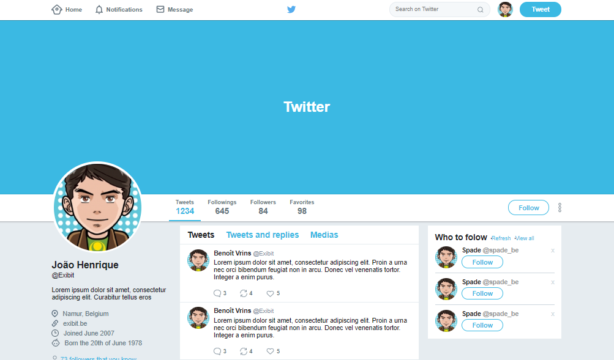

# GoBarber

Sistema básico para agendamento de serviços de barbeiro.

## Getting Started

Essas instruções farão com que você tenha uma cópia do projeto em execução na sua máquina local para fins de desenvolvimento.

### Prerequisites

```
- Servidor http
```

### Installing

1° Passo: Execute o comando abaixo para clonar o repositorio:

```
git clone https://github.com/Joaoh3326/flexbox.git
```



## Built With

- HTML
- CSS
- FLEXBOX

## Authors

- **João Henrique**

## License

This project is licensed under the MIT License - see the [LICENSE.md](LICENSE.md) file for details
